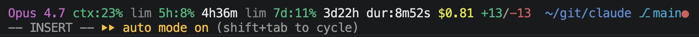

# Claude Extensions

## Status Line

A custom status line that shows model, context usage, 5h/7d rate limits with reset countdowns, session duration, cost, lines changed, cwd, and git branch.

See [status_line/](status_line/) — run `status_line/install.sh` to install.

## Refs

- [mcp/](mcp/)
