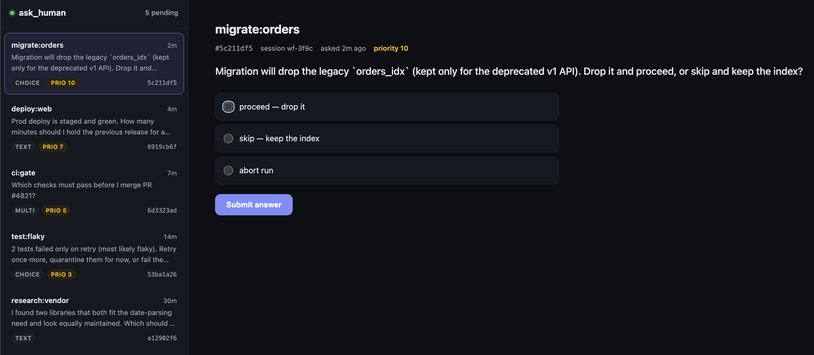

# ask_human — human-in-the-loop question broker (MCP)

Lets **headless agents ask a human and block for the answer**. Claude Code
filters the `AskUserQuestion` tool out of subagents and Workflow agents at the
system level ([claude-code#12890](https://github.com/anthropics/claude-code/issues/12890)),
so a spawned agent has no built-in way to reach you. But subagents *can* call
MCP tools, and an MCP tool may block until it returns — so this server gives
them an `ask_human_question` tool that records the question and waits until you answer
it from a separate channel.



*The `agent-chat web` console: every pending question on the left with its
metadata, answer the selected one on the right.*

```
 subagent / Workflow agent ── ask_human_question("Deploy?", ["yes","no"])
        │                                                   ▲
        ▼  INSERT pending row, then block-poll              │ {"answer": "yes"}
   ┌──────────────┐        ┌───────────────────────────┐   │
   │  server.py   │ ─────► │  SQLite  questions table   │ ──┘
   │  (FastMCP)   │        │  (store.py) WAL, atomic    │
   └──────────────┘        └───────────────────────────┘
                              ▲          ▲
                            CLI/TUI   web dash    ← answer from either
```

The **SQLite store is the single source of truth**; every frontend is a thin
client. Answering is an atomic `UPDATE ... WHERE status='pending'`, so the first
responder wins and channels can't double-answer.

## Why not MCP elicitation?

MCP's [elicitation](https://modelcontextprotocol.io/specification/draft/client/elicitation)
capability (Claude Code ≥ 2.1.76) is the "official" way for a server to request
input — but it routes through the **host UI**, the same surface subagents can't
reach, and subagent support is undocumented. The broker is deliberately
decoupled from the host: it owns its own out-of-band channel, survives long
blocks, and treats *thousands of agents → one queue* as the normal case.

## Install

```bash
./install.sh        # registers the MCP server + installs the `agent-chat` console on your PATH
```

Then answer questions from a separate terminal (same shared DB):

```bash
agent-chat          # auto-refreshing watch console (the default)
agent-chat web      # http://127.0.0.1:8765
```

## Tool (called by agents)

A single tool, kept deliberately simple:

| Tool | Behavior |
|------|----------|
| `ask_human_question(prompt, options?, multi_select?, agent_id?, session_id?, priority?)` | **Blocks until a human answers** — the wait is open-ended, with no timeout. It's async and the connection is kept alive with periodic progress pings, so blocking for minutes or hours is safe. Returns `{id, status, answer, answered_by}` (`status` is `answered` or `cancelled`). |

A call **waits indefinitely** until a human answers — there is no timeout. Keep
an operator console open (`agent-chat` or `agent-chat web`) so questions get
answered promptly; an unanswered question blocks its caller until you respond or
cancel it.

### Example (from a subagent / tool-using agent)

```python
ans = ask_human_question(
    prompt="Migration will drop the legacy index. Proceed?",
    options=["proceed", "skip", "abort run"],
    agent_id="migrate:orders",
    priority=10,
)
# -> {"id": "...", "status": "answered", "answer": "proceed", "answered_by": "web"}
```

## Operator console (`agent-chat`)

```bash
agent-chat                      # auto-refreshing watch console (the default)
agent-chat list                 # show pending
agent-chat answer 3f9c proceed  # answer by id prefix
agent-chat answer 3f9c py,go    # multi-select: comma-separated
agent-chat web                  # browser dashboard
```

## Configuration

| Env | Default | Purpose |
|-----|---------|---------|
| `ASK_HUMAN_DB` | `~/.claude/ask_human/questions.db` | shared SQLite file (set the same for server + frontends) |
| `ASK_HUMAN_WEB_ADDR` | `127.0.0.1:8765` | web dashboard bind address |

## Tests

```bash
uv run python tests/test_store.py   # or: uv run pytest tests/
```
